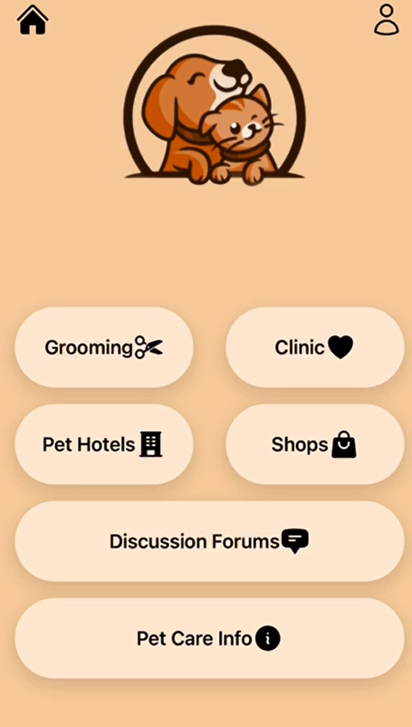
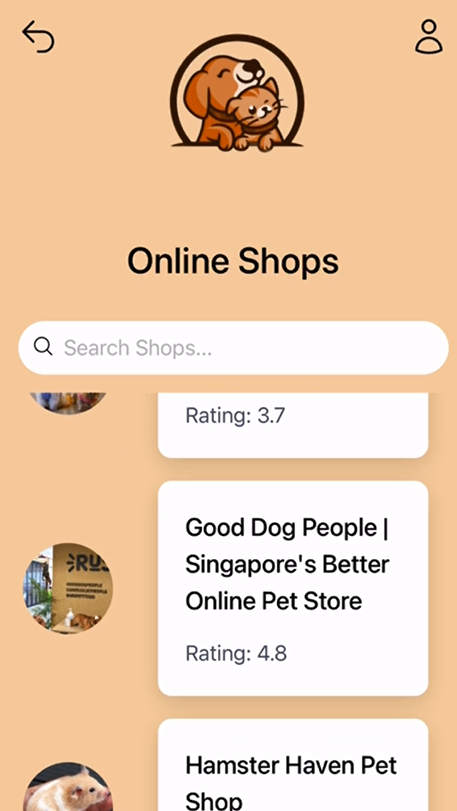
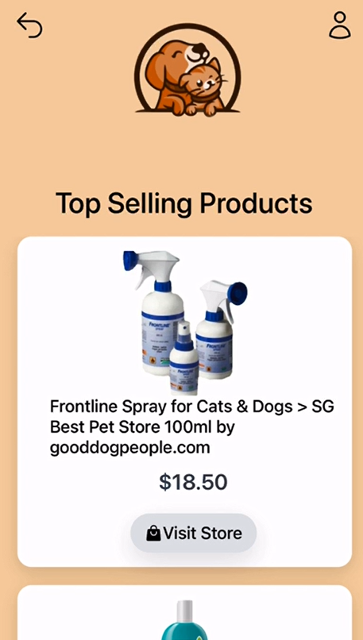

  
  
  

Abstract 
This project is a collaborative effort to develop a mobile application designed for pet owners, providing a comprehensive suite of features for effective pet management. The app leverages an SQL database with data stored in JSON files to handle various pet-related information and functionalities.

Key Features:
* Complete Pet Management: The app includes over 10 pages that offer functionalities such as tracking pet health, managing appointments, storing pet information, and accessing pet care resources.
* Database Integration: Uses an SQL database for robust data storage and retrieval, with JSON files utilized for data interchange and configuration.
* React-Based Development: Built with React, ensuring a dynamic and responsive user interface that enhances the user experience.
  
Technical Approach:
* SQL Database: Centralized storage for managing extensive pet care data, ensuring scalability and reliability.
* JSON Files: Employed for storing and transferring data, facilitating easy updates and integration.
* React: Utilized for creating a rich, interactive user interface with seamless navigation across more than 10 pages, providing a cohesive and user-friendly experience.
* Early experimentation with CMS such as Sanity and Firebase
  
Project Impact:
* The app serves as a one-stop solution for pet owners, simplifying the management of pet care tasks and information. Its extensive feature set and robust backend infrastructure make it a valuable tool for enhancing the pet ownership experience.

The project demonstrates the effective integration of modern web technologies and database management to create a functional and comprehensive mobile application.

