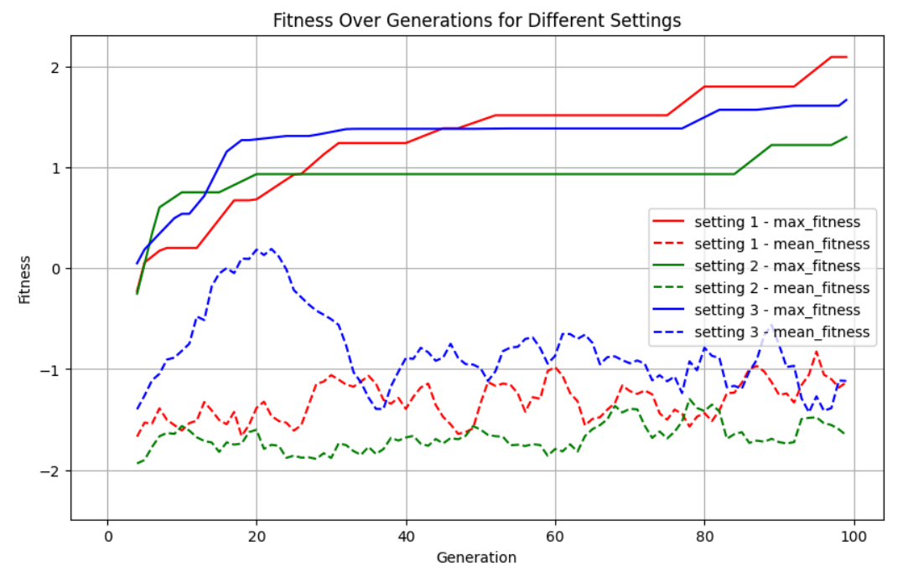

  

This project explores the application of genetic algorithms for solving complex optimization problems. Genetic algorithms, inspired by the principles of natural selection, are powerful tools for finding optimal solutions in large search spaces. By implementing a genetic algorithm, this project addresses specific optimization challenges, demonstrating the algorithm's effectiveness in evolving solutions over successive generations. The results underscore the potential of genetic algorithms in various optimization tasks, highlighting their adaptability and efficiency.

  

The aim of this project was to evolve the creatures to allow them to climb the mountain. Various experiments were carried out to find the optimal settings (e.g. mutation, population size, generations, gene structure etc). The creature was able to reach the mountain with the fitness function implemented, however was not able to reach the peak, which I will work on in future. 
