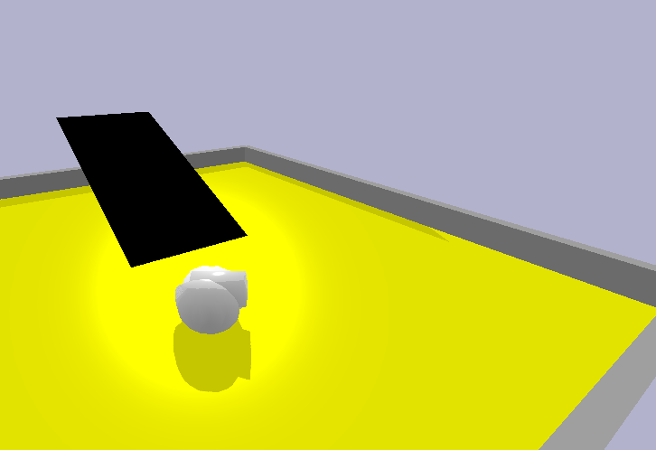
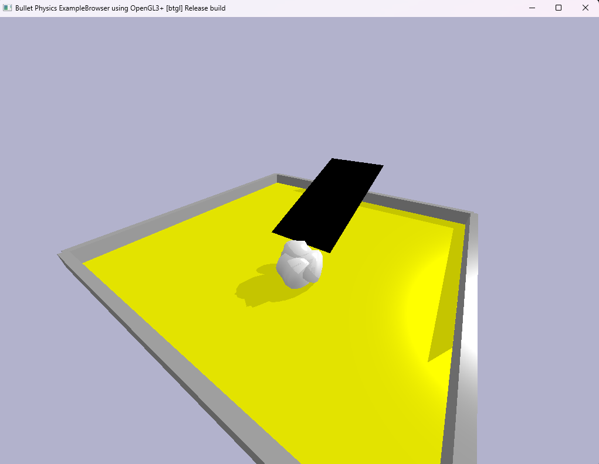
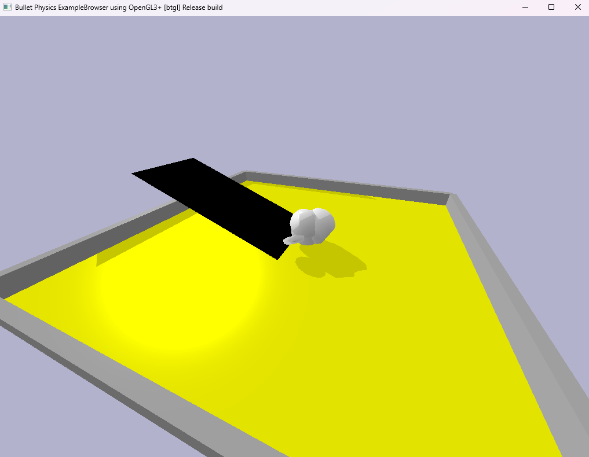

This project explores the application of genetic algorithms for solving complex optimization problems. Genetic algorithms, inspired by the principles of natural selection, are powerful tools for finding optimal solutions in large search spaces. By implementing a genetic algorithm, this project addresses specific optimization challenges, demonstrating the algorithm's effectiveness in evolving solutions over successive generations. The results underscore the potential of genetic algorithms in various optimization tasks, highlighting their adaptability and efficiency.

  

#### **Key Features**
1. **Simulation Environment:**
   - Created a simulated landscape to test creature performance.
   - Adjusted terrain friction and morphology to ensure realistic interactions.
  

  

2. **Genetic Algorithm Implementation:**
   - **Population Settings:** Tested population sizes (5, 10, 20) and genome complexity (2–3 genes).
   - **Mutation Strategies:** Evaluated multiple mutation rate settings to balance exploration and exploitation:
     - Default (e.g., [0.1, 0.25, 0.25, 0.1])
     - Aggressive simplifications (e.g., [0.6, 0.25, 0.9, 0.0])
     - Controlled growth for high complexity ([0.4, 0.25, 0.2, 0.5]).

3. **Fitness Function:**  
   A composite evaluation method encouraging:
   - **Vertical Climbing:** Maximized vertical distance (z-axis).  
   - **Horizontal Navigation:** Minimized horizontal distance to the mountain's center.  
   - **Center Reward:** Penalized movement away from the mountain's center.
  

  
  

---

#### **Experiments & Observations**
**Basic Parameters:**
- **Best Settings:** Population size of 10, gene count of 3, and mutation setting 5 achieved a peak fitness score of 3.401730.
- **Diversity Impact:** Larger populations (10–20) consistently outperformed smaller ones due to increased genetic diversity.
- **Gene Count:** Moderate genome complexity (3 genes) yielded the best results.

**Advanced Experiments:**
- **Morphological Variations:** Tested link length ([0.5, 2.0, 5.0]) and radius ([0.5, 1.0, 1.5]) to optimize reach, stability, and weight distribution.
- **Control Parameters:**
  - Adjusted control amplitudes ([0.1, 0.25, 1.0]) for movement strength.
  - Varied control frequencies ([0.5, 1.0, 1.5]) for movement rhythm.
- **Friction and Motor Output:**  
   Explored friction coefficients ([1.0, 5.0, 10]) and motor output for enhanced climbing capability.

  

   
**Challenges & Future Work:**
- Implementing **point-to-point joints** to improve limb mobility.
- Developing more complex landscapes to challenge evolved creatures further.
- Enhancing the fitness function for fine-tuned navigation and climbing.

---

#### **Outcomes**
- Successfully evolved creatures capable of climbing simpler landscapes.
- Identified optimal GA configurations for the simulation.
- Laid the groundwork for future experiments with advanced joint types and varied terrains.

---

This project highlights the ability to design and experiment with machine learning algorithms in creative and technically complex domains. It also demonstrates strong analytical skills through the detailed evaluation of experimental outcomes.
