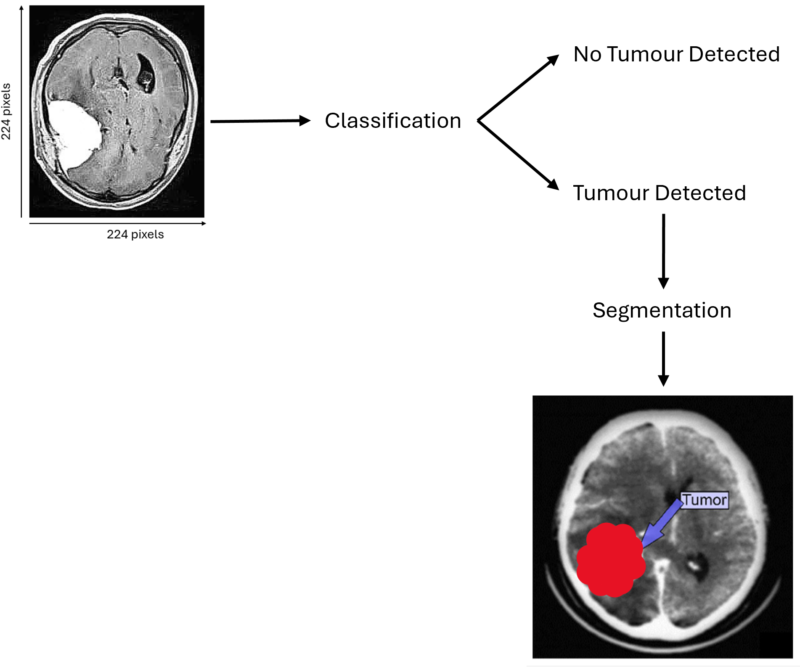
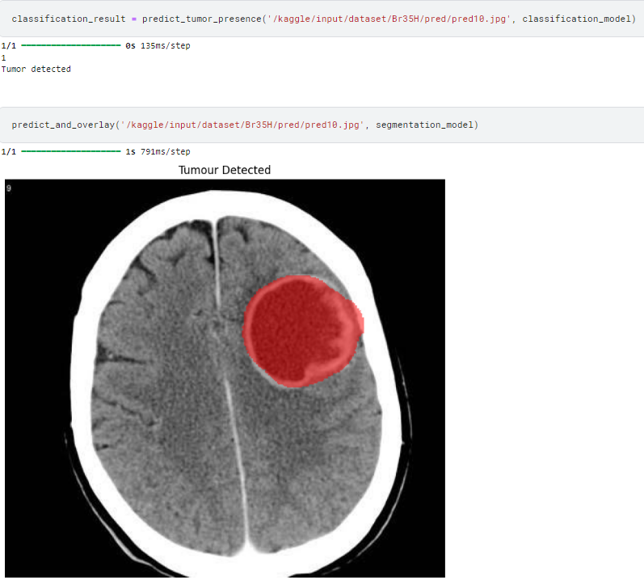
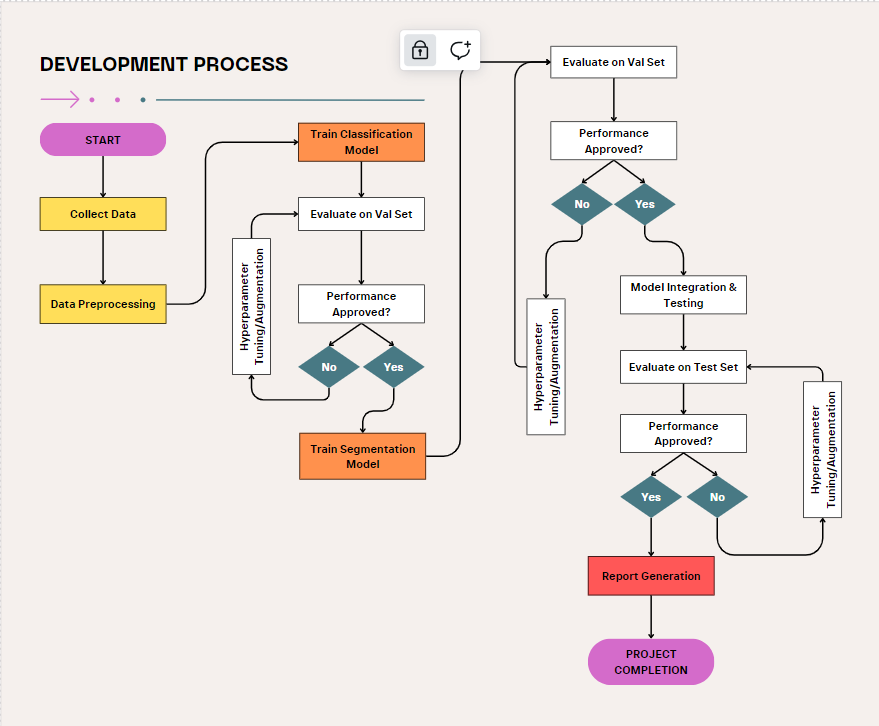
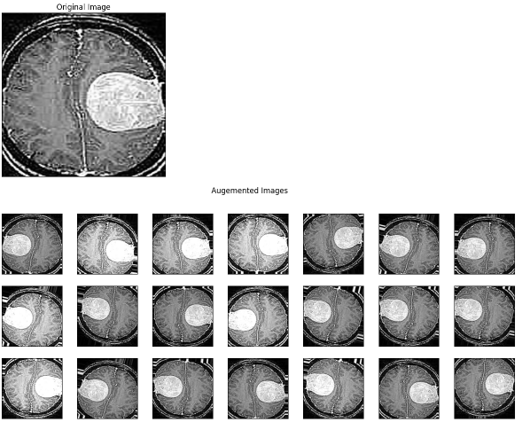
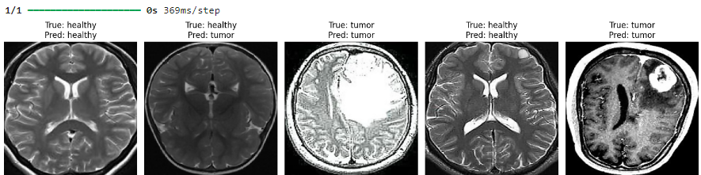
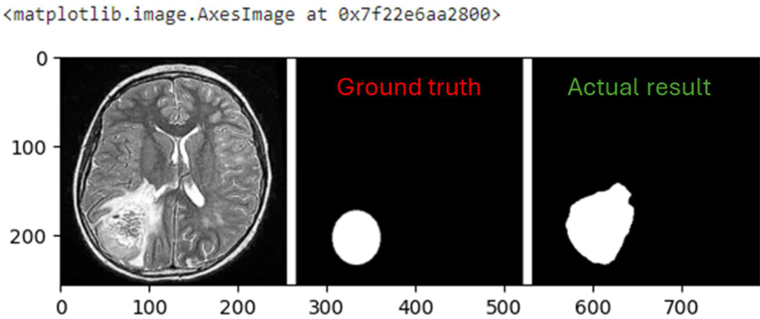
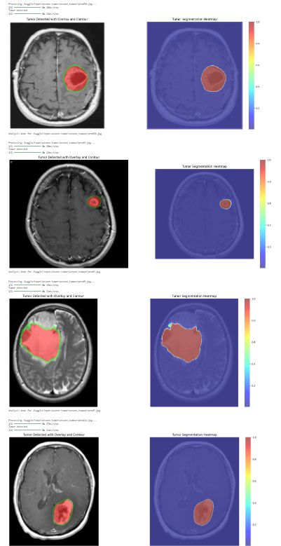
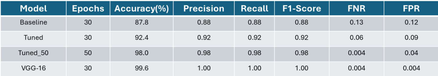
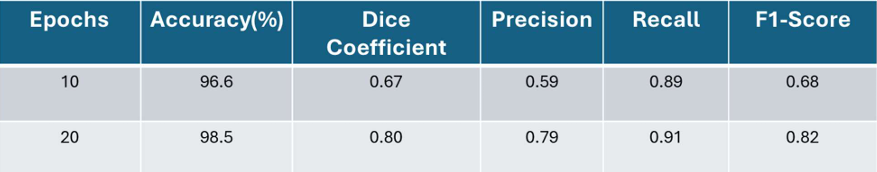

  
  

#### Overview ####
Detecting brain tumors is a critical step in early diagnosis and treatment planning, yet traditional methods often involve significant time and effort from medical professionals. This project aims to address these challenges with an automated system that leverages Convolutional Neural Networks (CNN) for classification and U-Net architectures for precise segmentation. By combining cutting-edge deep learning techniques, the system identifies and localizes tumors from MRI scans with remarkable accuracy, assisting healthcare practitioners in clinical decision-making.

---

#### The Technical Journey: A Three-Phase System ####
This system wasn't just built—it evolved through a meticulously designed pipeline. Here's a glimpse of the main phases that brought it to life:

  

#### Data Preprocessing: Preparing the Images ####
To ensure consistent and effective model inputs, MRI scans underwent rigorous preprocessing:  
1. **Standardization**: All images resized to 224x224 for CNN and 256x256 for U-Net to align with model requirements.  
2. **Brain Isolation**: Algorithms cropped brain regions using contour detection, eliminating irrelevant background noise.  
3. **Image Augmentation**: Techniques like rotation and flipping enriched the dataset, enhancing model generalization.

  

#### Model Implementation ####
1. **CNN for Classification**: Using a fine-tuned VGG16 model, the system classifies MRI scans as tumor-positive or tumor-negative, ensuring high recall rates to minimize false negatives.  
2. **U-Net for Segmentation**: A custom-built U-Net architecture pinpoints the exact tumor location, providing a visual overlay for clarity. The model employs Dice loss for enhanced accuracy in pixel-level predictions.  

  
  

#### Result Generation: Insights for Clinicians ####
The system produces intuitive and visually enriched results:
-  Overlay Visualization: Tumor regions are highlighted on MRI scans with red overlays and contours.
-  Heatmaps: Provide a color-coded intensity map of the tumor's location.
-  Large-Scale Automation: A batch-processing feature enables classification and segmentation of large volumes of MRI scans, optimizing efficiency in clinical workflows.

The solution is scalable, handling batch MRI scans from a directory. Each scan is processed, classified, segmented, and annotated with heatmaps, making it an invaluable tool for clinical applications requiring high throughput.

  

---

#### Key Features ####
- **Efficient Pipeline**: Seamless integration of classification and segmentation for end-to-end automation.  
- **Scalability**: Designed to process hundreds of MRI scans efficiently in a single batch.  
- **Clinical Utility**: Visual overlays and heatmaps offer intuitive insights for healthcare professionals.  

---

#### Challenges and Insights ####
Building this system presented unique challenges, from managing imbalanced datasets to optimizing models for high precision. A pivotal realization was the importance of pre-trained networks like VGG16 and advanced architectures like U-Net in bridging the gap between raw MRI data and actionable medical insights.

---

#### Proud Achievements ####
-  Developed a scalable system capable of processing entire MRI folders with automated detection and segmentation.
-  Achieved precise tumor localization, aiding early diagnosis and treatment planning.
-  Designed a pipeline that could easily integrate into real-world healthcare environments.

---

#### Results
- Classification

  

- Segmentation

  

---

#### Why This Matters ####
The automation of brain tumor detection is more than a technological advancement; it’s a step toward democratizing healthcare. By reducing diagnostic delays and increasing accuracy, this system empowers radiologists and clinicians, ultimately improving patient outcomes.

---

#### Final Thoughts ####
This project underscores the potential of AI in revolutionizing medical imaging. While it represents a leap forward in automating brain tumor detection, the journey doesn't end here. Future improvements could include incorporating 3D models and exploring multi-modal data to push the boundaries of accuracy and usability further.  

This experience not only strengthened my understanding of deep learning but also reinforced my belief in its capacity to address real-world challenges with transformative solutions.  
