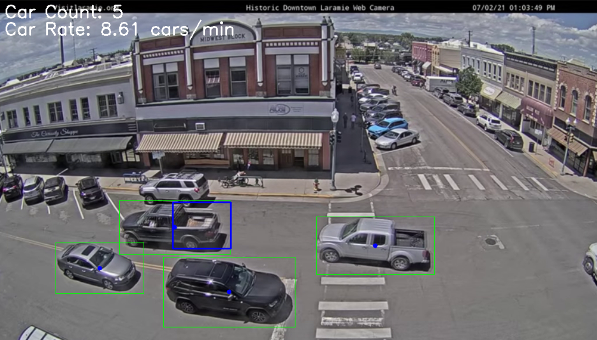

  

Abstract 
This project involves the development of a computer vision-based traffic monitoring system designed to count and track vehicles in real-time video feeds. The system utilizes frame differencing and background subtraction techniques to accurately detect and highlight moving vehicles. The blue region is the region of interest, where the cars passing this region are detected. 

Key Features:
* Region of Interest (ROI): Focuses monitoring on a specific area within the video frame, reducing computational load and false positives.
* Dynamic Buffer Time: Prevents double counting of vehicles that momentarily leave and re-enter the ROI, adjustable based on traffic flow characteristics.
* Real-Time Display: Provides a live video feed with detected vehicles highlighted, along with continuously updated metrics for total vehicle count and traffic rate.
  
Technical Approach:
* Frame Differencing: Calculates the absolute difference between consecutive video frames to identify regions with significant changes indicating motion.
* Background Subtraction: Models the static background of a scene and subtracts it from the current frame to segment moving objects, enhanced by GaussianBlur and morphological operations to remove noise.

Performance Metrics:
* The system effectively calculates and displays the total car count and the rate of cars passing through the ROI per minute, offering valuable insights for traffic management and analysis.
* The modular and object-oriented design of the system ensures flexibility and ease of maintenance, making it adaptable to various traffic scenarios and enhancing its robustness and effectiveness.
