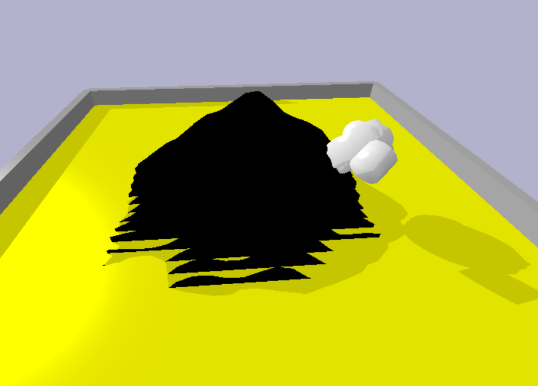

<!-- 

  

 -->

Utilize the implemented genetic algorithm (GA) to optimize the performance of virtual creatures in a simulated environment designed to mimic the challenge of climbing a mountain. Inspiration is taken from Karl Sims Creatures.
