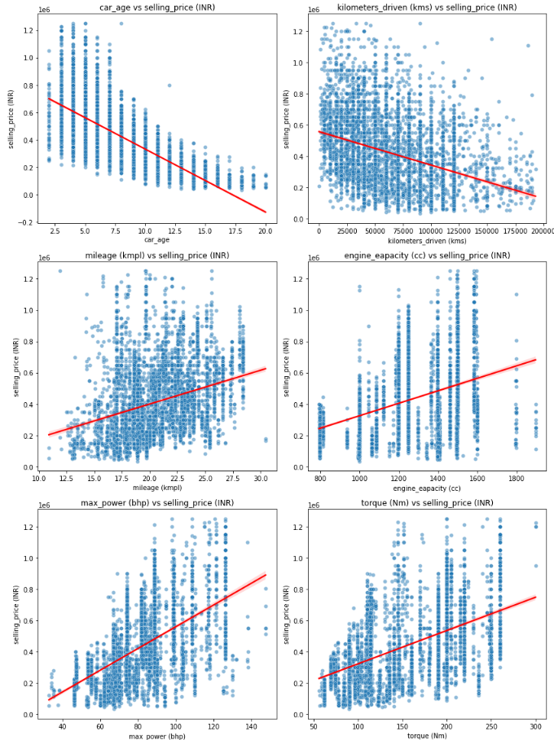

#### **Methodology**
The project follows a structured workflow:

1. **Data Preparation:**
   - Converted data types to their proper formats.
   - Addressed missing values, duplicates, and outliers.
   - Engineered features such as car age and mileage to enhance predictive power.

2. **Exploratory Data Analysis (EDA):**
   - Statistical Measures: Calculated measures of central tendency (mean, median) and spread (standard deviation, range).
   - Distribution Analysis: Assessed skewness and kurtosis to understand data symmetry.
   - Visualization Tools: Plots and heatmaps were used to identify relationships between numerical and categorical variables.

  
  
  
  

3. **Insights from Data Visualization:**
   - **Car Age vs Selling Price:** Newer cars fetch higher prices, indicating depreciation over time.
   - **Mileage vs Selling Price:** Vehicles with better mileage command higher prices, reflecting buyer preference for fuel efficiency.
   - **Fuel Type vs Selling Price:** Diesel cars are valued higher due to their superior mileage and efficiency.
   - **Seller Type vs Selling Price:** Cars sold by certified dealers often have higher prices, reflecting trust in quality.
   - **Transmission Type vs Selling Price:** Automatic vehicles command premium prices, likely due to higher manufacturing costs and demand.

  

4. **Correlation Analysis:**
   - Selling price strongly correlates with **car_age**, **max_power (bhp)**, and **torque (Nm)**, highlighting these as key factors in price prediction.

  
  

5. **Machine Learning Model Development:**
   - Applied linear regression to predict selling prices using significant features such as car age, engine capacity, max power, mileage, and fuel type.
   - Used **MinMaxScaler** for feature scaling and cross-validation to ensure model reliability and prevent overfitting.
   - Explored feature importance and engineered polynomial features for enhanced model performance.

  

6. **Model Evaluation:**
   - Cross-validation ensured robust performance across folds.
   - Comparative analysis of predictions on training and test datasets validated model generalizability.

  
  

---

#### **Key Insights**
1. **Feature Importance:**
   - Key predictors for selling price include **car_age**, **max_power (bhp)**, **engine_capacity (cc)**, and **torque (Nm)**.
   - Categorical factors like **fuel type** and **transmission type** also significantly impact pricing.

2. **Trends:**
   - **Depreciation:** Selling price decreases as car age increases.
   - **Efficiency Matters:** Buyers prefer cars with higher mileage and better fuel types, such as diesel.
   - **Transmission Preference:** Automatic vehicles are priced higher than manual ones.

3. **Market Dynamics:**
   - First-owner cars are preferred, reflecting better condition and higher trustworthiness.
   - Certified sellers (trustmark dealers) command higher prices compared to individual sellers.

---

#### **Conclusion**
- **Objective:** Analysis and prediction of used car prices using machine learning and statistical techniques.
- **Key Tools:** Python, Pandas, Matplotlib, Seaborn, Scikit-learn (Linear Regression, MinMaxScaler, Cross-Validation).
- **Outcome:** Developed a predictive model for car pricing and derived actionable insights into market trends, buyer preferences, and key pricing factors.
- **Impact:** Demonstrated a comprehensive workflow from data cleaning to advanced model development, showcasing proficiency in data science techniques.
