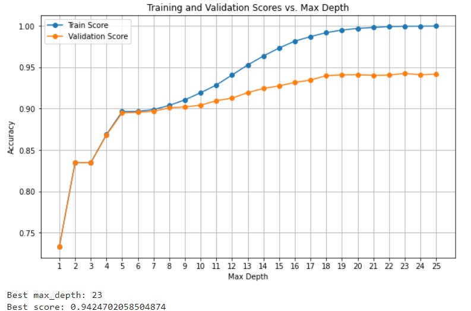

  
  

Project 1 focuses on identifying the optimal machine learning model for predicting diabetes based on patient health indicators. By comparing k-Nearest Neighbors (kNN), Naive Bayes, and Decision Trees, the project aims to find the model with the highest accuracy and the fewest false negatives. This work highlights the strengths and limitations of each algorithm in the context of diabetes diagnosis, providing valuable insights for improving predictive modeling in healthcare.The project required thorough validation and hyperparameter tuning as shown. The results are shown below.

  

Project 2 aims to develop a deep learning model to accurately classify hand gestures from the MNIST sign language dataset. Utilizing a multiclass classification approach with a softmax activation and categorical cross-entropy loss function, the goal is to create a robust model for sign language recognition. The project addresses challenges such as overfitting by balancing training and validation metrics, ultimately contributing to advancements in the field of sign language recognition.
