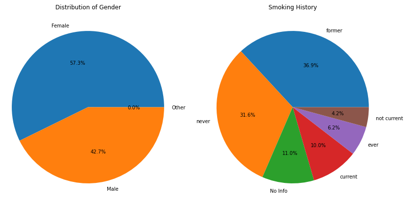
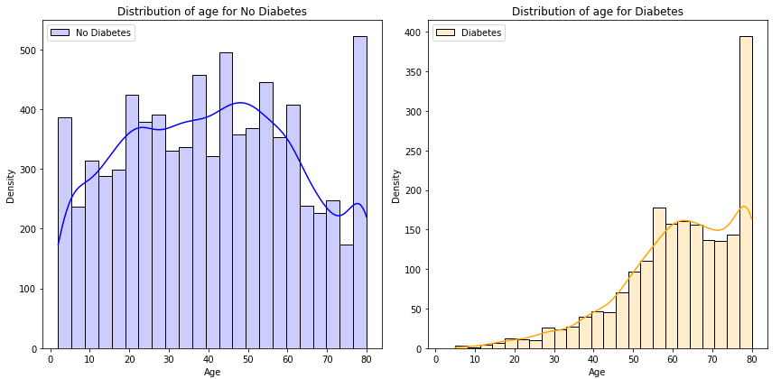
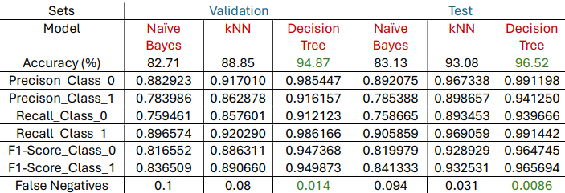
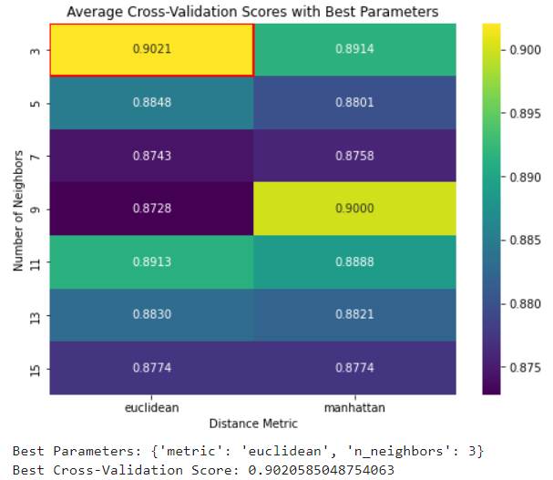
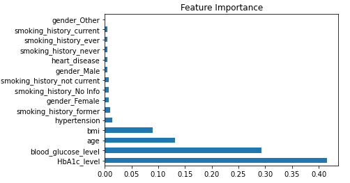
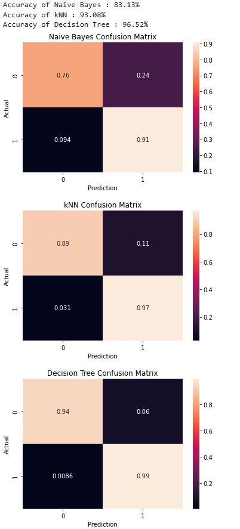
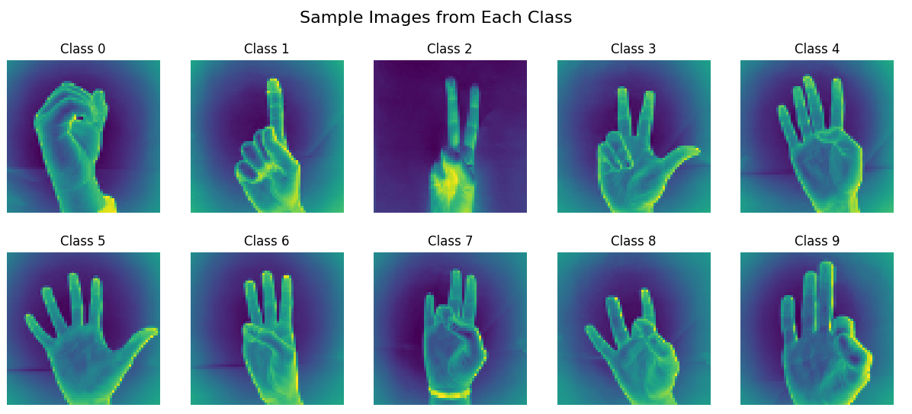
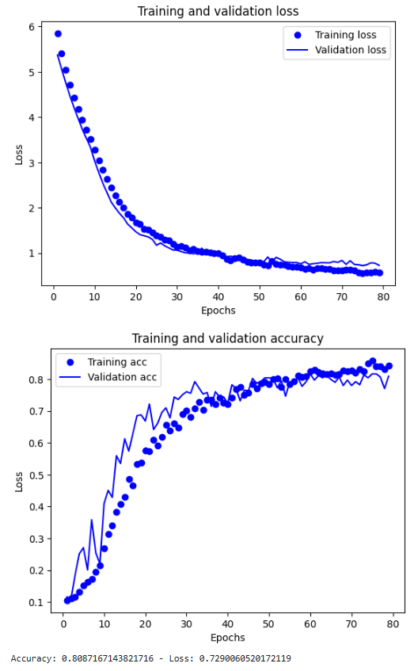
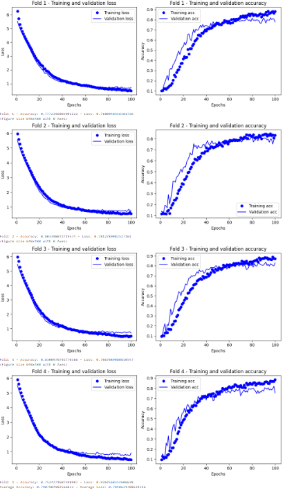
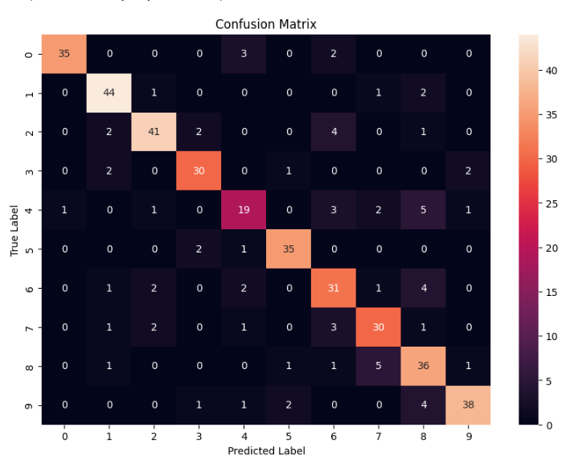

#### **Project 1: Diabetes Prediction Using Machine Learning**
Project 1 focuses on identifying the optimal machine learning model for predicting diabetes based on patient health indicators. By comparing k-Nearest Neighbors (kNN), Naive Bayes, and Decision Trees, the project aims to find the model with the highest accuracy and the fewest false negatives. This work highlights the strengths and limitations of each algorithm in the context of diabetes diagnosis, providing valuable insights for improving predictive modeling in healthcare.The project required thorough validation and hyperparameter tuning as shown. The results are shown below. A systematic approach was employed:

1. **Methods:**
   - Models: Naive Bayes, K-Nearest Neighbors (KNN), and Decision Tree classifiers.
   - Techniques: Exploratory Data Analysis (EDA), baseline model assessment, and hyperparameter tuning using GridSearchCV.
   - Metrics: Accuracy, Recall, Precision, and F1 Score.

  
  

2. **Key Findings:**
   - Decision Tree emerged as the most effective model, with the lowest false-negative rate.

  

   - Hyperparameter tuning revealed potential for further improvement, particularly by refining parameters like `min_samples_split`.
  

  

  

3. **Conclusion:**
   - The study underscored the importance of thorough model evaluation and parameter optimization to enhance predictive accuracy.
   - The iterative process of EDA, model selection, and tuning highlighted the strengths of each algorithm, culminating in a robust diabetes prediction framework.

  

---

#### **Project 2: Sign Language Recognition Using Deep Learning**
The goal of this project was to classify sign language gestures from the MNIST Sign Language dataset using deep learning models. The study emphasized model evaluation, overfitting prevention, and hyperparameter tuning. Reference was taken from the Chollet, F. Deep learning with Python. 1st edn (Shelter Island, NY: Manning Publications, 2017).

  

1. **Methods:**
   - Baseline Models: Developed underfit and overfit models to assess performance.
   - Advanced Models: Constructed three primary models—Final Model 1 (Hold-Out Validation), Hold-Out model (evaluated with K-Fold), and Final Model 2 (a more complex architecture).
   - Techniques: Dropout, L2 regularization, and parameter tuning for batch size, epochs, and layer architecture.

2. **Key Findings:**
   - Final Model 1 achieved the highest accuracy of 82.08%, demonstrating robust performance on hold-out validation.
   - K-Fold cross-validation with the Hold-Out model showed better generalization, with slightly lower accuracy but enhanced reliability.
   - Final Model 2 (a more complex model with an additional layer and increased epochs) exhibited comparable performance to simpler models, highlighting diminishing returns of added complexity without adequate tuning.

  

  

3. **Conclusion:**
   - A systematic comparison of evaluation methods and architectures showcased the trade-offs between accuracy and generalization.
   - K-Fold cross-validation emerged as a robust validation strategy, reducing dataset-specific biases.
   - The project illustrated the importance of balancing complexity and generalization for real-world applications.

  

---

### Conclusion
- **Key Technologies:** GridSearchCV, Dropout, L2 Regularization, Decision Trees, and K-Fold Cross-Validation.
- **Impact:** Demonstrated how systematic model evaluation and tuning can lead to robust, generalizable solutions.
- **Takeaways:** Insight into balancing model complexity and computational cost while achieving reliable predictions for healthcare and sign language recognition applications.
