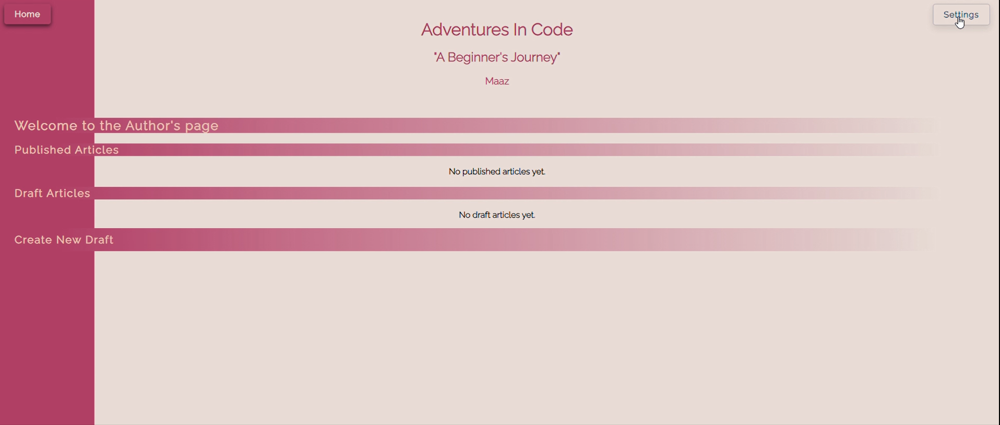
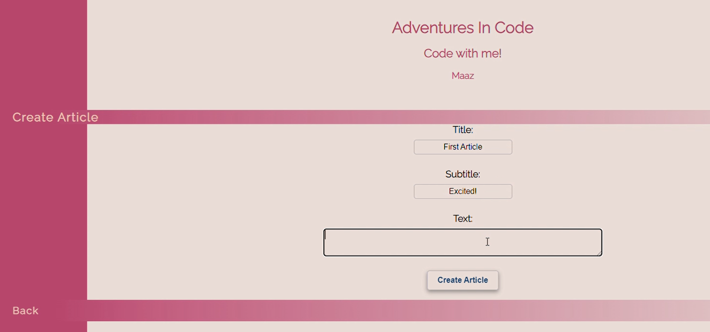
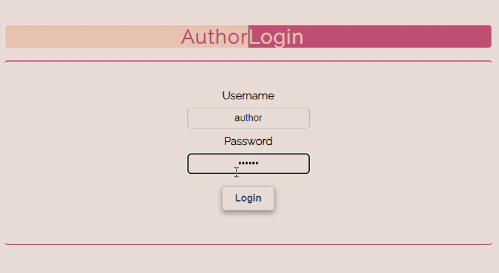
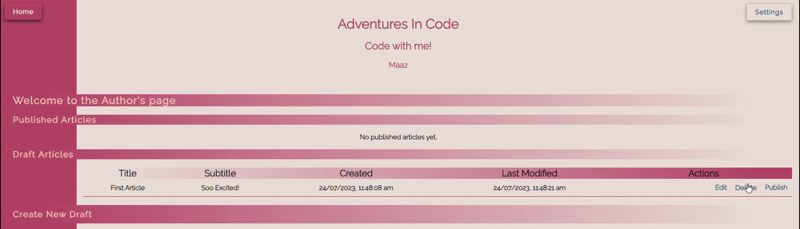
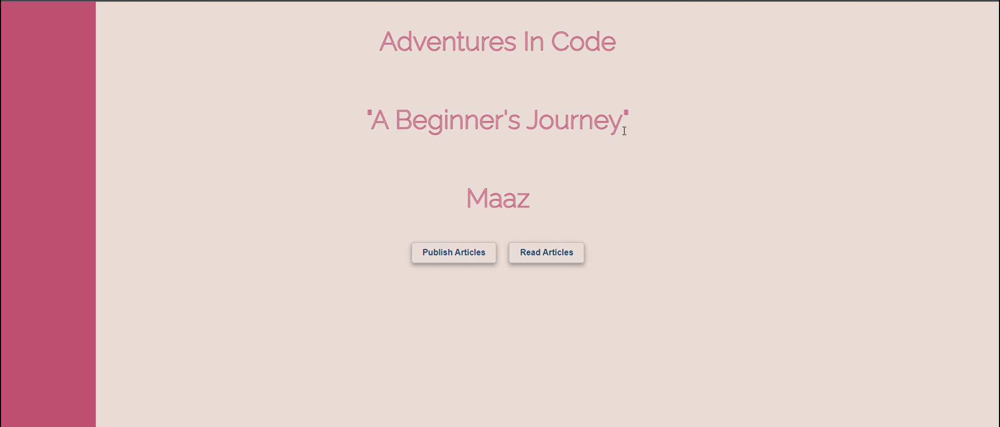

  

  

#### Project Overview ####
This is a Node.js-based web application that interacts with an SQLite3 database. It allows users to publish and read articles through a web interface. The application includes a password-protected authoring section and a reader section for accessing published content. This project showcases my understanding of Node.js, SQLite, and web application development principles, emphasizing modularity, database handling, and user interface design.

#### Dependencies ####
  - **Node.js**: Used for server-side development.
  - **SQLite3**: Database for storing and retrieving articles.

#### Features ####
1. **Article Publishing**:
   - Accessible via the "Publish Articles" button.
   - Password-protected.
   - Enables authors to create and store articles.
  

  

  

2. **Article Reading**:
   - Accessible via the "Read Articles" button.
   - Displays stored articles for general users.

  

#### Development Details ####
- **Database Schema**:
  - Defined in `db_schema.sql` for consistency and easy recreation.
  - Supports rebuilding with `npm run clean-db` and `npm run build-db`.

- **Routing and EJS Templates**:
  - Routes serve pages for publishing and reading articles.
  - EJS templates used for dynamic content rendering.

- **Scripts**:
  - Scripts are defined in `package.json`:
    - `build-db`: Builds the database from `db_schema.sql`.
    - `clean-db`: Removes the existing database.
    - `start`: Starts the Node.js application.
    - `end`: Stops the Node.js process.

---
