#### Project Overview ####
The dataset contains data regarding graduate employment outcomes, salaries, and related metrics. The goal was to critique the dataset, model its structure, implement it as a MySQL database, and create a simple Node.js-based web application to query and display insights from the data.

  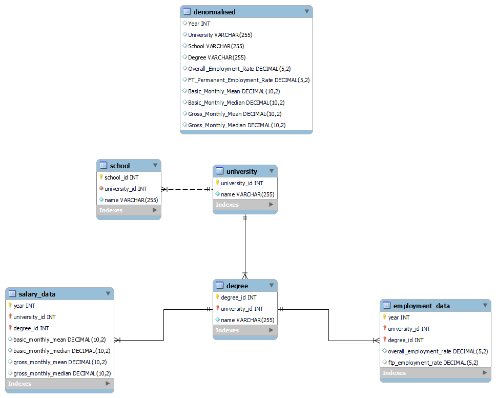

---

#### Key Project Stages ####

1. **Dataset Analysis and Critique**:
   - Dataset: GES dataset of Singapore universities.
   - **Critique**:
     - Examined the dataset for completeness, consistency, and relevance.
     - Identified data fields such as university names, courses, employment rates, median salaries, and job types.

  

    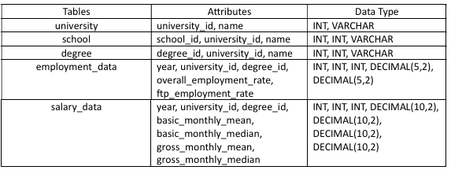
  

   - **Questions Formulated**:
     - What is the average Full-Time Permanent (FTP) and Overall Employment Rates for each university?
     - What is the trend in the highest mean and median salaries for each year from 2013 to 2021, along with the corresponding university and degree?
     - Which degree is facing a declining Full-Time Permanent (FTP) and Overall Employment Rates?

  

    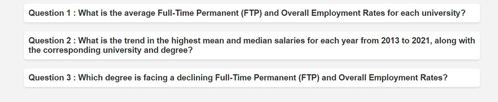
  

2. **E/R Model Creation**:
   - **Entity-Relationship Model**:
     - Modeled entities such as **Universities**, **Courses**, **Graduates**, and **Employment Outcomes**.
    
    

      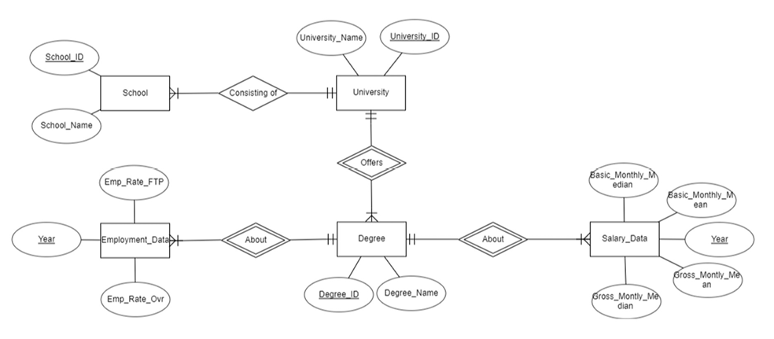
      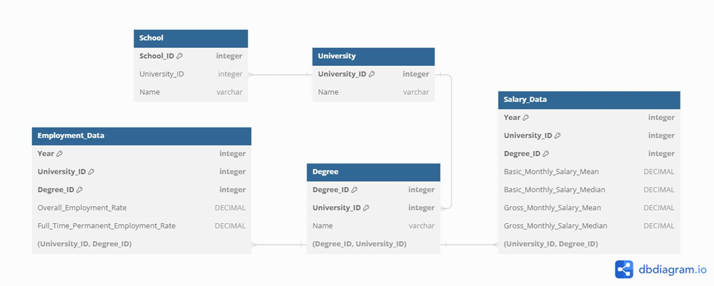
    

    
     - Defined relationships, such as:
       - "Universities offer Courses."
       - "Graduates complete Courses."
       - "Graduates have Employment Outcomes."
   - Adjusted for relational database implementation:
     - Normalized the design to reduce redundancy.
     - Incorporated primary and foreign keys for all relationships.

3. **MySQL Database Implementation**:
   - Built a relational database in MySQL based on the E/R model.
   
    

      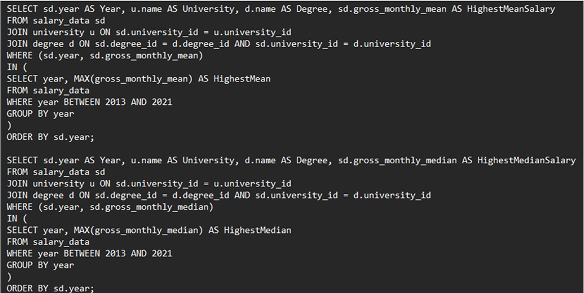
      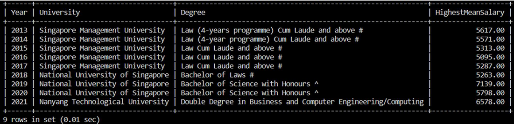
    

   - Populated the database with sufficient data to ensure:
     - All tables had meaningful entries.
     - Relationships were demonstrated through multiple queries.
   - **Data Populated**:
     - Universities: Names, types (public/private).
     - Courses: Names, fields, and associated universities.
     - Employment Outcomes: Salaries, job types, and rates.

4. **Web Application Development**:
   - Built a simple **Node.js-based web application** to interact with the MySQL database.
   - Implemented functionalities to:
     - Display lists of universities and courses.
     - Query employment outcomes and salaries.
     - Answer formulated questions dynamically (e.g., "Which courses offer the highest mean salaries?").
     
  

    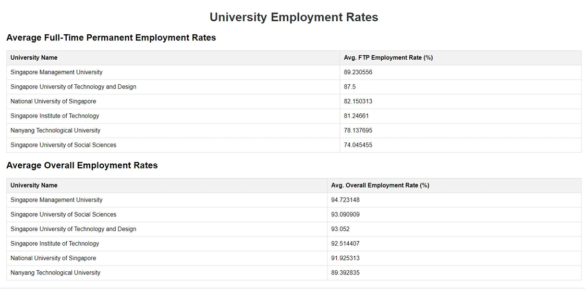
    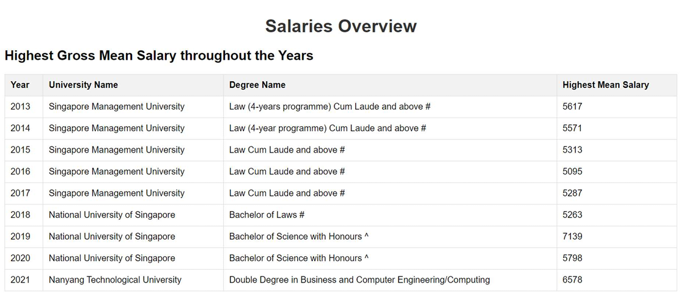
    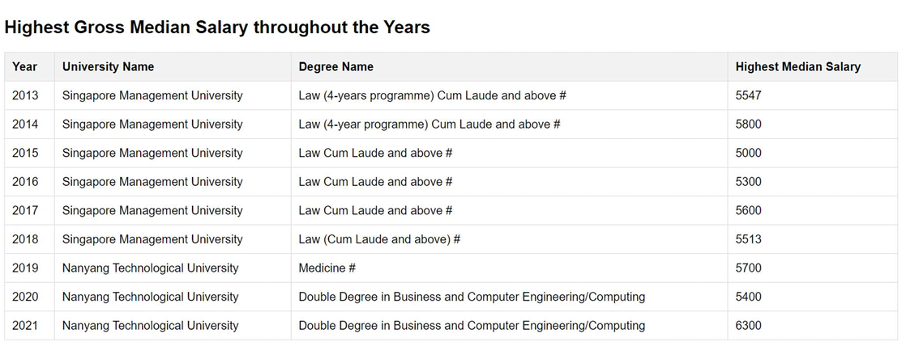
    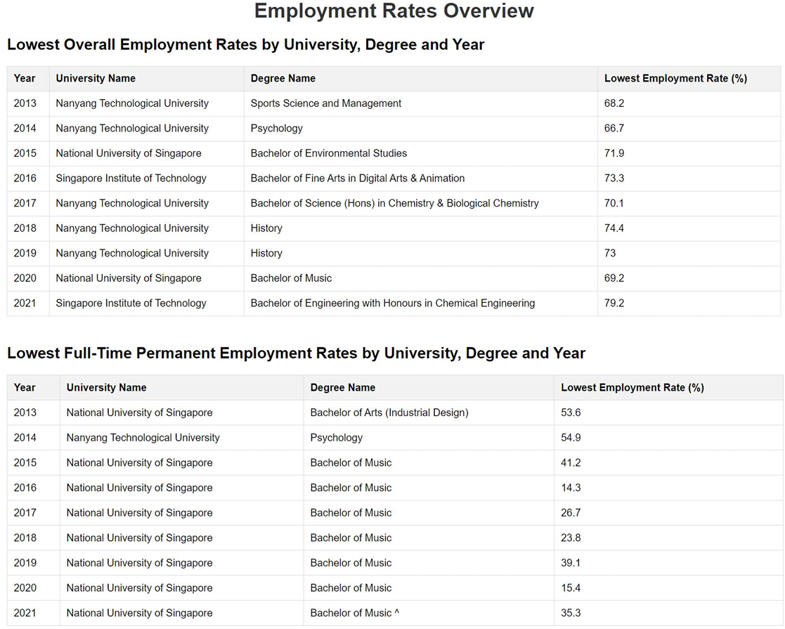
  

   - **Technologies Used**:
     - Node.js for server-side scripting.
     - MySQL as the backend database.
     - Basic HTML/CSS/JavaScript for the user interface.

---

#### Deliverables ####
1. **Report**:
   - Critique of the dataset.
   - E/R diagrams illustrating the database structure.
   - Queries demonstrating answers to key questions.

2. **MySQL Database**:
   - Populated with GES data.
   - Normalized and optimized for queries.

3. **Node.js Web Application**:
   - Accessible via a shareable link to a lab environment.
   - Interface designed to display and query GES data.

4. **Dataset Source URL**:
   - Provided a link to the original dataset for verification and replication.

---

#### Project Outcomes ####
This project successfully demonstrated the ability to analyze a dataset, model it using E/R diagrams, implement a relational database, and develop a web application to query and visualize data. It highlights a strong understanding of database design, web development, and the practical application of data analysis to answer real-world questions.
